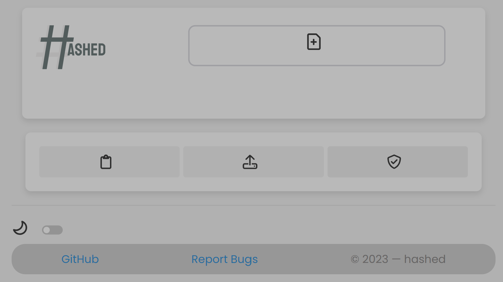
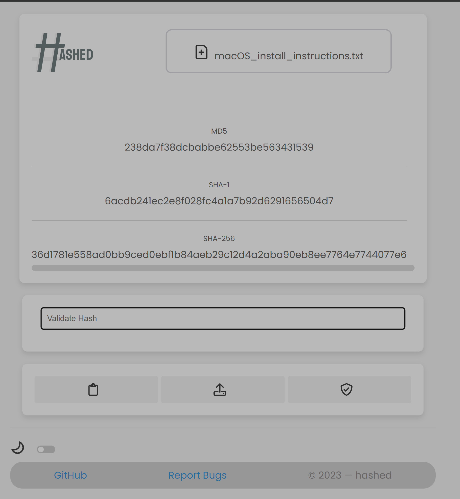
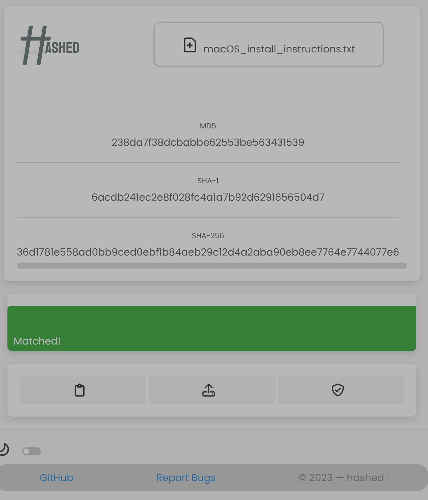

 <svg width="75" height="75" viewBox="0 0 275 275" fill="none" xmlns="http://www.w3.org/2000/svg">
      <circle cx="137.5" cy="137.5" r="137.5" fill="#333333"/>
      <path d="M142.434 223.5L170.98 49.5H187.973L159.426 223.5H142.434ZM63.25 175.242L65.9687 158.25H130.879H195.789L193.07 175.242H63.25ZM81.2617 223.5L109.809 49.5H126.801L98.2539 223.5H81.2617ZM73.4453 114.75L76.1641 97.7578H205.984L203.266 114.75H73.4453Z" fill="#919191" fill-opacity="0.1"/>
      <path d="M150.16 224.25L178.707 50.2499H195.699L167.152 224.25H150.16ZM88.9884 224.25L117.535 50.2499H134.527L105.981 224.25H88.9884ZM81.172 115.5L83.8907 98.5078H213.711L210.992 115.5H81.172Z" fill="#748081"/>
    </svg>

---

# HASHED — Chrome Extension 

## Overview
This Chrome extension provides a user-friendly interface for verifying downloaded files through hash comparison. It supports various hash algorithms such as MD5, SHA-1, and SHA-256. The extension includes features like dark mode, file validation, progress tracking, and clipboard copying of hash results.

## Getting Started
1. [Download and install the extension from the Chrome Web Store](#) (Link will be provided once available).
2. If you want to use the extension before it's available on the Chrome Web Store, you can clone the repository and enable developer mode in Chrome:
   - Clone the repository: `git clone https://github.com/yourusername/yourproject.git`
   - Open Chrome and go to `chrome://extensions/`.
   - Enable "Developer mode" in the top right corner.
   - Click "Load unpacked" and select the extension folder from the cloned repository.
   - Open the extension by clicking on its icon in the Chrome toolbar.
## Screenshots

## Features
### File Verification
1. **Verify Downloaded File:** Click on the "Verify" button to initiate the file verification process.
2. **Upload File:** Use the "Upload File" button to select the file for verification.
3. **Progress Tracking:** Track the upload progress with a visual progress bar during file selection.

### Hash Comparison
1. **Hash Algorithms:** The extension supports MD5, SHA-1, and SHA-256 hash algorithms.
2. **User Input Validation:** Ensure secure file verification by validating user input against calculated hashes.

### Dark Mode
1. **Toggle Dark Mode:** Enable or disable dark mode based on your preference.

### Copy to Clipboard
1. **Copy Hash Results:** Easily copy hash results to the clipboard for external use.

## Usage
1. **Select File:** Click on "Upload File" to select the file you want to verify.
2. **Verify File:** After uploading, click "Verify" to compare the file's hash with user input.

## Notifications
1. **Verification Status:** Receive a notification indicating whether the file matches the provided hash.

## Additional Information
1. **File Information Display:** View the file name in the user interface.
2. **Responsive Design:** The extension adapts to various screen sizes.

## Support and Contribution
- For bug reports or feature requests, please [submit an issue](https://github.com/yourusername/yourproject/issues).
- Contributions are welcome! Fork the repository, make changes, and submit a pull request.
- Keep an eye on the [Chrome Web Store](#) for updates and the latest version of the extension.

## License
This Chrome extension is licensed under the [MIT License](LICENSE).

**© 2023 DEVINCI-IT.**
